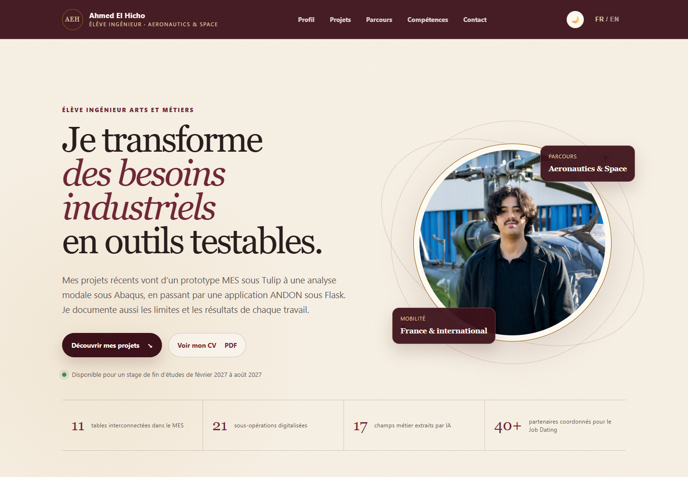

# Portfolio — Ahmed El Hicho

Je suis élève ingénieur aux Arts et Métiers, dans le parcours Aeronautics & Space. Ce dépôt rassemble les projets qui m'ont permis de travailler sur la mécanique, la simulation et la digitalisation industrielle.

**Site publié :** [elhicho.github.io/ahmed-el-hicho.github.io](https://elhicho.github.io/ahmed-el-hicho.github.io/)

## Aperçu

## Ce que contient le portfolio

Trois projets sont présentés en priorité :

- un prototype MES sous Tulip, réalisé en équipe de trois sur la plateforme X-Manufacturing ;
- un prototype de reporting audio développé pendant mon stage chez DOGA FZ ;
- une analyse modale sous Abaqus comparée à des mesures expérimentales.

Neuf autres projets académiques complètent cette sélection : ANDON digital, SVM par Uzawa, éco-audit, équilibrage dynamique, étude d'un VAE, simulation FEMM d'une MSAP, chaîne de traction, Taguchi L8 et base de données Access.

Pour chaque projet, le site précise le contexte, la méthode, les résultats et les limites. Les douze rapports techniques sont accessibles depuis les cartes correspondantes.

## Choix de présentation

- Les prototypes sont distingués des systèmes déployés.
- Les chiffres affichés proviennent du CV final ou des rapports joints.
- Les outils réellement utilisés sont séparés des notions étudiées et des sujets de veille.
- La version française et la version anglaise couvrent le même contenu.

## Technique

Le site est statique et ne dépend d'aucun framework :

- `index.html` : structure et contenu principal ;
- `styles.css` : mise en page, responsive et thèmes clair/sombre ;
- `script.js` : traductions, filtres et interactions ;
- `assets/reports/` : rapports techniques PDF ;
- `assets/media/` : photographies liées aux expériences collectives.

Il peut être servi directement par GitHub Pages.
